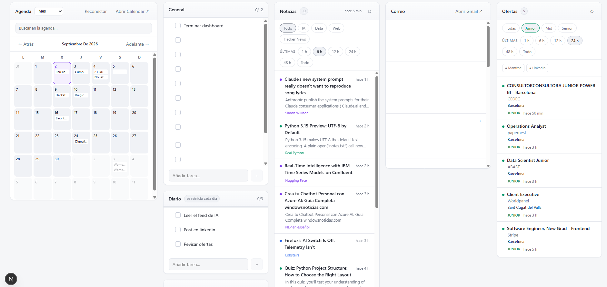

# Dashboard

Panel personal en local que unifica Gmail, Google Calendar, agregador de noticias de IA/data/web, seguimiento de ofertas y postulaciones y checklists en una sola pantalla.



## Motivación

Sustituye la rutina de abrir Gmail, Calendar, varias webs de noticias y una lista de tareas sueltas por un único panel local: una vista con todo lo relevante del día, sin depender de servicios de terceros para almacenar datos.

## Características

- **Gmail + Google Calendar**: lectura de correo y agenda vía OAuth2 (permisos de solo lectura, `gmail.readonly` / `calendar.readonly`).
- **Agregador de noticias**: fuentes RSS configurables por categoría (IA / data / web) + Hacker News vía la API de Algolia, filtrado por puntuación y palabras clave. Caché de 15 minutos y aviso si alguna fuente falla.
- **Postulaciones**: seguimiento de las candidaturas de las últimas 2 semanas (empresa, puesto, canal, fase, prácticas o empleo, lugar y horario si constan) con los días transcurridos desde cada una. Se alimenta de `data/postulaciones.csv` (se crea solo) y de las ofertas que marcas «Ya apliqué» en Empleos. Con un botón indicas si sigues adelante o te han descartado.
- **Empleos (`/empleos`)**: lee el CSV de un scraper propio en Python (LinkedIn y Tecnoempleo, páginas públicas sin login ni cookies) y lo puntúa con criterios propios: rol, cercanía, nivel junior, frescura y competencia. Descarta senior, titulaciones no relacionadas y ofertas antiguas. El scraper vive en [`scraper/`](scraper/README.md) (configurable con `scraper/config.json`) y se lanza solo en segundo plano al abrir el dashboard: máx. cada 12 h, nunca dos a la vez y con espera larga si un portal limita las peticiones.
- **Checklists**: listas fijas (General, Diaria con reinicio automático) y listas personalizadas ilimitadas.
- **Datos 100% locales**: todo se persiste en SQLite en disco; los tokens OAuth nunca salen del equipo.

## Stack técnico

| Área | Tecnología |
|---|---|
| Framework | [Next.js](https://nextjs.org/) 16 (App Router) |
| UI | [React](https://react.dev/) 19 |
| Base de datos | SQLite vía el módulo nativo [`node:sqlite`](https://nodejs.org/api/sqlite.html) de Node 24 — sin drivers externos ni compilación nativa |
| Integraciones | [`googleapis`](https://www.npmjs.com/package/googleapis) (OAuth2, Gmail API, Calendar API), [`rss-parser`](https://www.npmjs.com/package/rss-parser), API de Algolia (Hacker News) |
| Scraper | Python 3.10+ con [`requests`](https://pypi.org/project/requests/) y [`beautifulsoup4`](https://pypi.org/project/beautifulsoup4/) |
| Runtime | Node.js 24+ |

Dashboard en JavaScript (JSX), sin dependencias de UI de terceros: estilos con CSS plano y componentes React hechos a mano.

## Arquitectura

```
app/
  page.jsx, layout.jsx      punto de entrada (App Router)
  api/
    auth/                   flujo OAuth2 con Google
    gmail/, calendar/       lectura de Gmail y Calendar
    news/                   agregador RSS + Hacker News
    empleos/                ofertas del scraper (puntuadas) y su estado
    postulaciones/          seguimiento de candidaturas
    checklists/, items/     CRUD de checklists

lib/
  db.js                     esquema SQLite y lógica de reinicio diario
  google.js                 OAuth2 + llamadas a Gmail y Calendar
  feeds.js                  fuentes de noticias (config declarativa)
  news.js                   agregador RSS + Hacker News, con caché
  empleos.js                CSV del scraper -> ofertas puntuadas y filtradas
  postulaciones.js          CSV de postulaciones + las marcadas en Empleos
  scraper-runner.js         lanza el scraper en segundo plano con límites

scraper/                    scraper de ofertas en Python (ver su README)
scripts/setup.mjs           prepara .env.local, config y CSV si faltan

components/                 UI en React (cliente)
```

Cada integración externa (Gmail, Calendar, noticias, empleo) vive detrás de su propia ruta de API en `app/api/`, que a su vez delega en un módulo de `lib/`. El estado de la app (checklists, tokens, caché de eventos) se guarda en una única base SQLite en `data/`.

## Puesta en marcha

Necesitas Node 24+ y, solo para el scraper, Python 3.10+.

```bash
git clone https://github.com/Ruthlessallen/dashboard.git
cd dashboard
npm install
npm run setup   # crea .env.local, scraper/config.json y los CSV; instala las dependencias de Python
npm run dev
```

Se abre en <http://localhost:3111> (en Windows también puedes hacer doble clic en `dashboard-start.bat`). `setup` es idempotente: nunca pisa lo que ya tienes, y `npm run dev` lo ejecuta antes de arrancar. Sin configurar nada ya funcionan las noticias, las checklists y las postulaciones; Gmail y Calendar necesitan las credenciales de abajo, y el scraper se configura en [`scraper/config.json`](scraper/README.md).

## Configurar integraciones (opcional)

Las variables de entorno van en `.env.local` (`npm run setup` lo crea a partir de `.env.local.example`).

### Gmail y Calendar (Google OAuth)

1. Entra en [Google Cloud Console](https://console.cloud.google.com/) y crea un proyecto.
2. **APIs y servicios → Biblioteca**: habilita **Gmail API** y **Google Calendar API**.
3. **Pantalla de consentimiento OAuth**: tipo *Externo*, rellena nombre y correo. Añade tu correo en **Usuarios de prueba**.
4. **Credenciales → Crear credenciales → ID de cliente de OAuth** → *Aplicación web*. En **URIs de redirección autorizados**:
   ```
   http://localhost:3111/api/auth/google/callback
   ```
5. Copia el *Client ID* y *Client secret* a `.env.local`:
   ```
   GOOGLE_CLIENT_ID=...
   GOOGLE_CLIENT_SECRET=...
   GOOGLE_REDIRECT_URI=http://localhost:3111/api/auth/google/callback
   ```
6. Reinicia `npm run dev` y pulsa **Conectar Google**.

Los permisos son solo de lectura: el dashboard no puede enviar correo ni modificar la agenda.

### Ofertas de empleo

Las busca el [scraper](scraper/README.md), que se lanza solo al abrir el dashboard (máx. cada 12 h). Para verlas y puntuarlas a tu medida, indica tu municipio en `.env.local` (`JOBS_HOME_TOWN`) para valorar la cercanía; el resto de variables opcionales están comentadas en `.env.local.example`.

### Fuentes de noticias

Se editan en [`lib/feeds.js`](lib/feeds.js): una entrada por fuente (`id`, `name`, `cat`: `ia` / `data` / `web`, URL del RSS). `enabled: false` la desactiva sin borrarla.

Hacker News no usa RSS: se consulta la API de Algolia filtrando por puntuación mínima y palabras clave, configurables al final del mismo fichero.

## Para agentes de IA

[`AGENTS.md`](AGENTS.md) explica cómo funciona el scraper, el dashboard y el sistema de ofertas y postulaciones, y qué hay que preguntar a la persona usuaria antes de ejecutar el scraper (`CLAUDE.md` apunta al mismo archivo).

## Seguridad y privacidad

- Ninguna credencial está hardcodeada: todas se leen de variables de entorno (`.env.local`, excluido de git).
- Los tokens OAuth de Google se guardan en la base SQLite local (no sale del equipo, pero no está cifrada) y nunca se envían a ningún servidor externo.
- Los permisos solicitados a Google son de solo lectura.
